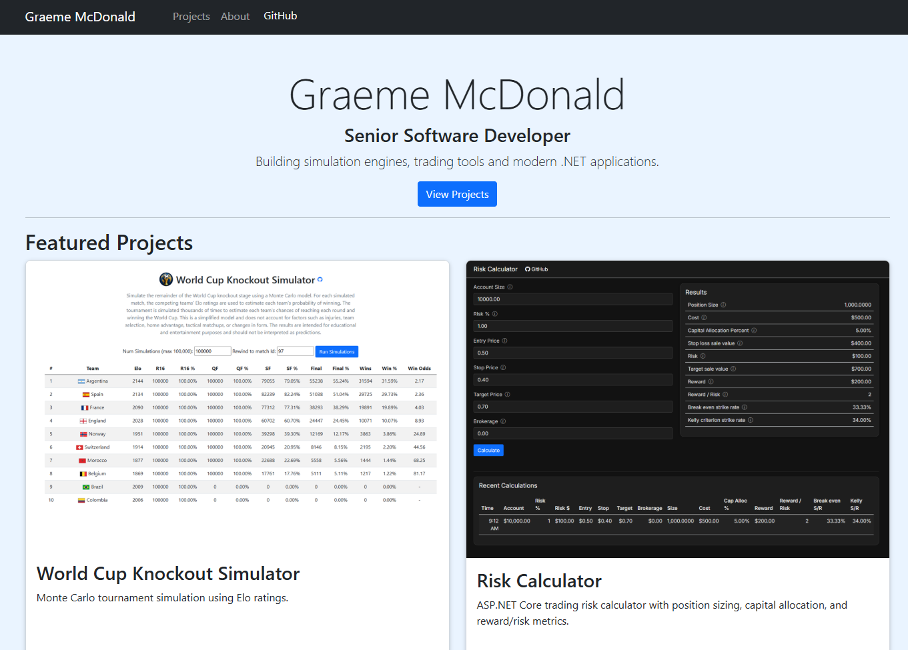

# Personal Portfolio Website

A personal portfolio website showcasing my software development projects, technical experience, and ongoing work.

The site is designed to provide an overview of my projects while also allowing each project to have a more detailed case study describing the problem, approach, implementation, and lessons learned.



## Features

* Data-driven project cards
* Individual project case study pages
* Project screenshots and images
* Links to GitHub repositories and live applications
* Markdown-based project documentation
* Responsive layout
* Clean, minimal design
* About section and personal information

## Technology

* **C#**
* **ASP.NET Core**
* **Razor Pages**
* **HTML / CSS**
* **Bootstrap**
* **Markdig** — Markdown-to-HTML rendering
* **JSON / C# data** for project information
* **GitHub** for source control and project repositories
* **Azure** for hosting

## Architecture

Projects are stored as structured data containing information such as:

* Project name
* Description
* Screenshot
* Technologies
* GitHub repository
* Live application
* Project slug

The project cards are generated dynamically from this data.

Each project can also have a detailed case study. The case study content is written in Markdown and rendered by the ASP.NET Core application using Markdig.

The general flow is:

```text
Project Data
     |
     v
Project Card
     |
     v
Project Details Page
     |
     v
README.md
     |
     v
Markdig
     |
     v
HTML
```

## Project Case Studies

Each project has a unique slug that is used to generate its details page.

For example:

```text
/Projects/Details/world-cup-simulator
```

The details page loads the corresponding project information and renders the project's Markdown documentation.

This allows the same Razor Page template to be reused for every project rather than creating a separate Razor Page for each project.

## Projects

Some of the projects showcased on the site include:

### World Cup Knockout Simulator

A Monte Carlo simulation application that estimates the probability of teams reaching different stages of the FIFA World Cup knockout tournament using Elo ratings.

### Risk Calculator

A position sizing and risk management application for calculating trade size based on account size, risk percentage, entry price, stop loss, target price, and brokerage.

Additional projects will be added as they are completed.

## Running Locally

Clone the repository:

```bash
git clone <repository-url>
```

Navigate to the project directory:

```bash
cd <project-directory>
```

Run the application:

```bash
dotnet run
```

Then open the local URL shown by ASP.NET Core.

## Purpose

This project is both a personal portfolio and an ongoing demonstration of software development skills.

The site itself is also treated as a project, with improvements being made as I learn new technologies and develop new applications.

## Author

**Graeme McDonald**

GitHub: [gmcdonald73](https://github.com/gmcdonald73)
